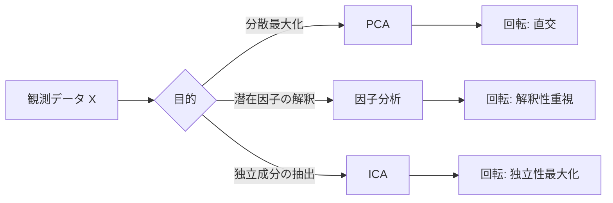

# データ空間の回転系手法まとめ（PCA・因子分析・ICA）

## 目的と位置づけ
- **PCA（主成分分析）**：分散を最大化する直交基底を見つけ、次元削減・可視化・ノイズ除去に使う。
- **因子分析（FA）**：観測変数を少数の潜在因子＋誤差で説明するモデル。説明可能性と因子解釈が目的。
- **ICA（独立成分分析）**：観測信号を統計的に独立な成分に分解する。混合信号の分離や特徴抽出に使う。

## 直感的な違い（ざっくり）
| 手法 | 目的 | 仮定 | 得られる成分 | 典型用途 |
|---|---|---|---|---|
| PCA | 分散最大化 | 線形・直交 | 直交な主成分 | 次元削減、可視化、前処理 |
| 因子分析 | 潜在因子の推定 | 線形・誤差分離 | 潜在因子（回転可能） | 心理尺度、説明変数の整理 |
| ICA | 独立成分の抽出 | 非ガウス・独立 | 独立成分（非直交可） | 信号分離、盲源分離 |

## 何が「回転」か
- PCAは**直交回転**で分散の大きい方向に座標軸を合わせる。
- 因子分析は**回転（例：バリマックス回転）**で因子の解釈性を高めることが多い。
- ICAは**独立性**を最大化する回転（一般には直交制約なし）と考えられる。

## 選び方の目安
- **次元削減＋前処理**が目的 → PCA
- **潜在因子を解釈したい** → 因子分析（回転を前提）
- **信号の混合分離や独立成分を取りたい** → ICA

## 数式（最小限）
- PCAの最適化（直交制約付きの分散最大化）
  - $\max_{w} \; \mathrm{Var}(Xw)$  s.t. $\|w\|_2=1$
- 因子分析（観測$x$を潜在因子$f$と誤差で表現）
  - $x=\Lambda f+\epsilon,\;\; f\sim \mathcal{N}(0,I),\;\epsilon\sim\mathcal{N}(0,\Psi)$
- ICAのモデル（線形混合の独立成分分解）
  - $x=As,\;\; s_i \text{ は互いに独立}$

## 図（概念フロー）


## 触れるミニUI（角度を変えて回転のイメージをつかむ）
<div style="border:1px solid #ddd;padding:12px;border-radius:8px;max-width:560px;">
  <p><strong>回転角（度）</strong>：<span id="angle-value">0</span>°</p>
  <input id="angle-slider" type="range" min="0" max="90" value="0" step="5" style="width:100%;" />
  <button id="rotate-btn" type="button">45°にセット</button>
  <pre id="vector-out" style="background:#f7f7f7;padding:8px;border-radius:6px;">(x, y) = (1.00, 0.00)</pre>
</div>
<script>
  const slider = document.getElementById("angle-slider");
  const value = document.getElementById("angle-value");
  const out = document.getElementById("vector-out");
  const btn = document.getElementById("rotate-btn");
  const rad = (deg) => (deg * Math.PI) / 180;
  const update = (deg) => {
    const x = Math.cos(rad(deg)).toFixed(2);
    const y = Math.sin(rad(deg)).toFixed(2);
    value.textContent = deg;
    out.textContent = `(x, y) = (${x}, ${y})`;
  };
  slider.addEventListener("input", (e) => update(e.target.value));
  btn.addEventListener("click", () => {
    slider.value = 45;
    update(45);
  });
  update(0);
</script>

## scikit-learnでの最小例
### PCA
```python
from sklearn.decomposition import PCA

pca = PCA(n_components=2, random_state=0)
X_pca = pca.fit_transform(X)
```

### 因子分析
```python
from sklearn.decomposition import FactorAnalysis

fa = FactorAnalysis(n_components=2, random_state=0)
X_fa = fa.fit_transform(X)
```

### ICA
```python
from sklearn.decomposition import FastICA

ica = FastICA(n_components=2, random_state=0)
X_ica = ica.fit_transform(X)
```

## 実務メモ
- PCAはスケーリングに敏感。標準化前提が多い。
- 因子分析は**回転**が解釈性に影響する。`sklearn`は回転機能が少ないので、必要なら外部ライブラリも検討。
- ICAは初期値や収束に敏感。再現性を担保するなら`random_state`を固定。

## 参考キーワード
- 「バリマックス回転」「プロマックス回転」
- 「盲源分離（BSS）」「独立成分」
- 「共分散行列」「固有値分解」「SVD」
